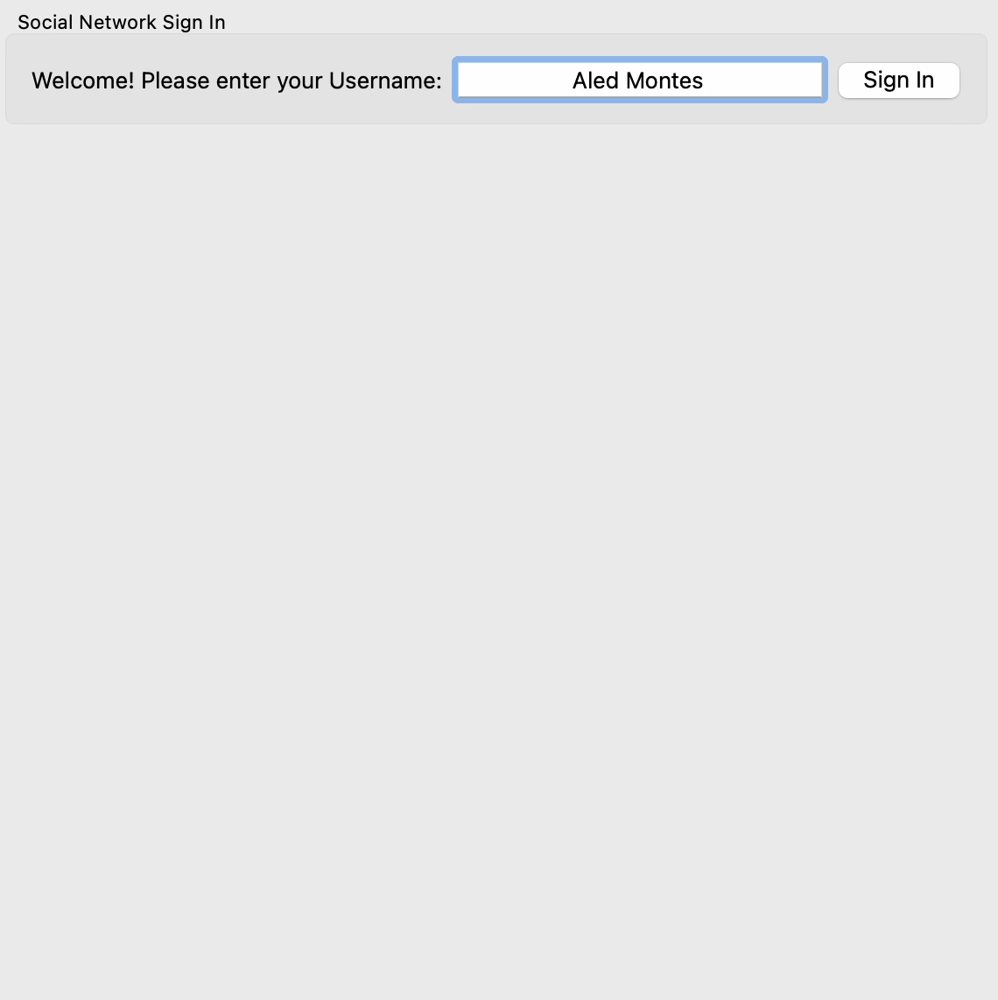
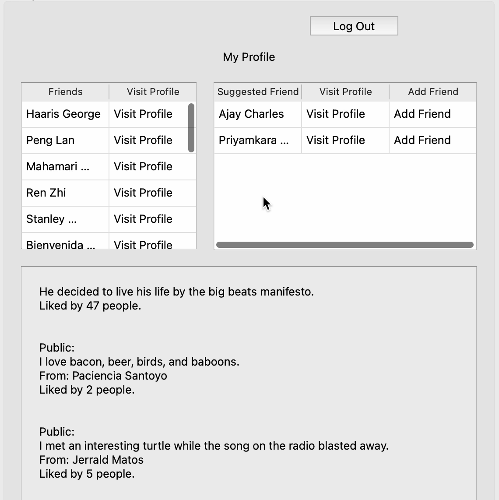

# Social Network


A desktop social networking simulation built with C++17 and Qt6, allowing users to log in, manage friends, and interact with a network graph.
This project demonstrates graph algorithms, object-oriented design, and a Qt GUI, showcasing  both systems programming and application development.

---

## Table of Contents

- [Features](#Features)
- [Screenshots and Demo](#Screenshots-and-Demo)
- [Tech Stack](#Tech-Stack)
- [Project Structure](#Project-Structure)
- [Getting Started](#Getting-Started)
- [Testing](#Testing)
- [Future Improvements](#Future_Improvements)

---

## Features
- **Login System**
  - Authenticate with an existing username and password.
- **User Profiles**
  - View basic information (name, friends, suggested friends, posts).
  - Navigate between users.
- **Friendship Management**
  - Add and remove friends
  - View friend lists
  - See suggested friends
- **Posts Feed**
  - Read posts and their like count
  - Private and public post options
- **Graph Algorithms on Network**
  - Suggest friends using mutual connections
  - Compute shortest path between two users
  - Identify connected components to find friend groups
- **Qt GUI**
  = Multi-screen navigation (login, profile, network view)
  - Responsive interface built with Qt Widgets

---
  
## Screenshots and Demo

| Login Screen | Profile View | Adding Friends |
|--------------|--------------|---------------------|
|  |  |  |

---

## Tech Stack
- **C++17**
- **Qt6** (Widgets, UI Designer)
- **CMake** build system

---

## Project Structure
```plaintext
/SocialNetwork
│
├── include/              # Header files
│   ├── network.h
│   ├── user.h
│   ├── post.hpp
│   └── mainwindow.h
│
├── src/                  # Source files
│   ├── network.cpp
│   ├── user.cpp
│   ├── post.cpp
│   ├── mainwindow.cpp
│   └── main.cpp
│
├── resources/            # Input data, icons, screenshots
│   ├── social_network.txt
│   └── posts.txt
│
├── tests/                # Unit tests
│   └── test_network.cpp
│
├── docs/              # Header files
│   ├── login.png
│   ├── logged_in.png
│   └── add_friend.gif
│
├── CMakeLists.txt
└── README.md
```
---

## Getting Started

**Prerequisites**
- Qt6 (Widgets, Core, UIC)
- CMake ≥ 3.16
- Compiler with C++17 support

**Build & Run**
```bash
git clone https://github.com/cjr03/SocialNetwork.git
cd social-network
mkdir build && cd build
cmake ..
make
./SocialNetwork
```
---

## Testing

Unit tests cover:
- Network: Find valid user, do not find invalid user, retrieve correct posts
- User: Creation, post association
- Post: Creation, retrieval, and storage

Run all tests:
```bash
cd tests
gcc -std=c++17 test_network.cpp -o test
./test
```
---

## Future Improvements

- Add user registration and password functionality
- Add post creation UI
- Enhance UI/UX and add dark/light mode toggle
- Replace text file storage with SQL database
